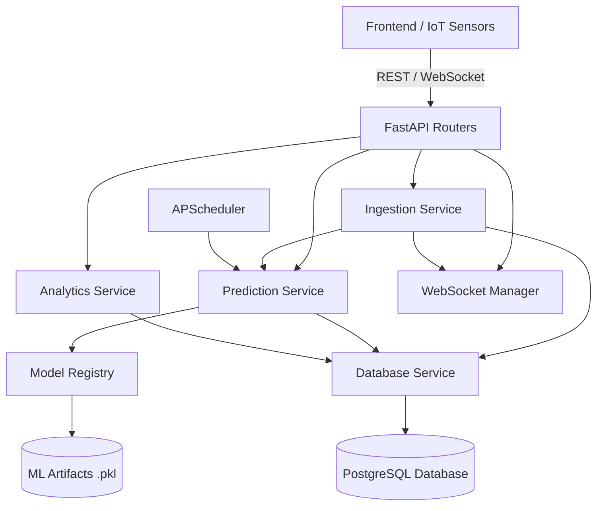

# 💧 Bhu-Jal: Groundwater Intelligence Platform

Welcome to the **Bhu-Jal Groundwater Intelligence Platform**! This project provides an end-to-end, real-time AI-powered system for monitoring, forecasting, and analyzing groundwater levels across various monitoring stations.

## 🚀 Key Features

- **Real-Time Ingestion**: Event-driven pipeline that instantly validates, stores, and processes incoming sensor readings.
- **AI-Powered Forecasting**: Predictive models loaded dynamically to generate up to 7-day groundwater level forecasts.
- **Interactive Dashboard**: A reactive React/Vite frontend with dynamic maps, time-series charts, and real-time WebSocket updates.
- **System Monitoring**: Built-in endpoints for tracking database connectivity, model loading status, and system metrics.
- **Dockerized Deployment**: Fully containerized backend (FastAPI), frontend (Nginx), and database (PostgreSQL) for seamless production readiness.

---

## 🏗️ Architecture Overview

The system follows a modular, service-oriented architecture designed for scalability and real-time performance.

### Backend Architecture



### Tech Stack
- **Backend**: FastAPI, SQLAlchemy, APScheduler, WebSockets
- **Machine Learning**: Scikit-Learn, Pandas, NumPy
- **Frontend**: React, Vite, TanStack Query, Tailwind CSS, Recharts
- **Database**: PostgreSQL (Dockerized) / SQLite (Local)
- **Deployment**: Docker, Docker Compose

---

## 📂 Repository Structure

The workspace is organized into dedicated modules:

```text
bhu-jal/
├── backend/          # FastAPI backend, routers, database schemas, and background services
├── frontend/         # React/Vite dashboard and UI components
├── ml/               # Machine Learning pipelines, model artifacts, and evaluation scripts
├── docs/             # Technical specifications, phase trackers, and architecture docs
├── notebooks/        # Jupyter notebooks for EDA and model experimentation
├── data/             # Raw and processed datasets
└── docker-compose.yml # Container orchestration configuration
```

---

## 🛠️ Getting Started

### Prerequisites
- Docker & Docker Compose
- Python 3.12+ (for local development)
- Node.js 18+ (for local development)

### Quick Start (Docker)

The fastest way to get the system up and running is via Docker Compose:

1. Clone the repository and navigate to the root directory.
2. Ensure you have your environment variables set up (you can copy the provided `.env.example` to `.env`).
3. Build and launch the containers:
   ```bash
   docker-compose up --build
   ```
4. Access the platform:
   - **Dashboard**: [http://localhost:80](http://localhost:80)
   - **API Docs (Swagger)**: [http://localhost:8000/docs](http://localhost:8000/docs)

### Local Development

If you prefer running services locally:

**Backend:**
```bash
pip install -r requirements.txt
cd backend/app
python -m uvicorn main:app --reload
```

**Frontend:**
```bash
cd frontend
npm install
npm run dev
```

---

## 📜 Documentation

For more detailed technical specifications, refer to the `docs/` folder:
- [Backend Architecture](docs/03_backend_architecture.md)
- [Real-Time Pipeline](docs/07_realtime_pipeline.md)
- [API Contracts](docs/04_api_contract.md)
- [Deployment Guide](docs/08_deployment.md)

---

## 📄 License
This project is licensed under the terms specified in the [LICENSE](LICENSE) file.