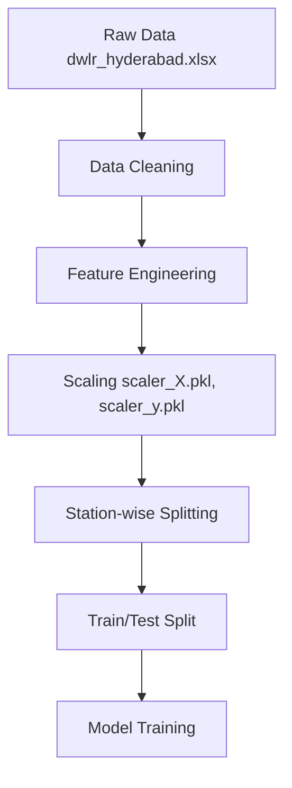

# Dataset Documentation

## Dataset Source
- **Primary Source**: Raw data is stored in `data/raw/dwlr_hyderabad.xlsx` and `data/raw/big_telegana.xlsx`.
- **Context**: The data consists of Digital Water Level Recorder (DWLR) readings for Hyderabad, Telangana.

## Column Descriptions (Assumption)
Since the exact preprocessing scripts are not fully defined, the following are the assumed standard columns for DWLR time-series data:
- `Date`: Timestamp of the reading.
- `Station_Name`: Identifier for the monitoring station.
- `Latitude` / `Longitude`: Geographical coordinates.
- `Water_Level`: Depth to water level (in meters below ground level).

## Features (Assumption)
The following features are assumed to be engineered for model training based on standard time-series forecasting for groundwater:
- `Month`, `Year`, `DayOfYear`: Temporal features extracted from the date.
- `Lag_1`, `Lag_7`, `Lag_30`: Past water levels (lagged features).
- `Rolling_Mean_7d`, `Rolling_Mean_30d`: Smoothed rolling averages.
- `Precipitation` / `Temperature` (if available from IMD station data).

## Target Variable
- **Target**: `Future_Water_Level` (e.g., Water level at t+1, t+7, or t+30 days).

## Cleaning Steps
- Removal of duplicate records.
- Handling missing values via interpolation or forward/backward filling.
- Outlier detection (e.g., removing impossible water levels).

## Feature Engineering
- Standardization of continuous features using `StandardScaler` or `MinMaxScaler` (artifacts like `_scaler_X.pkl` confirm this).
- Temporal encoding for time-series models.

## Station Distribution
Models have been trained for specific locations across Hyderabad.
Stations identified in the artifacts:
- AMBERPET_1
- BAGH_LINGAMPALLY-PZ_1
- BEGAMPET_(BALKAMPET)
- BEGAMPET_(IMD)
- BOWENPALLY_1
- ERRAGADDA-PZ_1

## Train/Test Strategy
- **Temporal Split** (Assumption): As this is time-series data, a chronological split (e.g., 80% train, 20% test) is likely used instead of a random split to prevent data leakage.

## Time-series Assumptions
- **Assumption**: The data frequency is daily or monthly.
- **Assumption**: Groundwater variations are seasonal and exhibit trend patterns.

## Data Flow

