# Model Registry

This document lists the currently trained models and their associated artifacts found in `ml/artifacts/`.

## General Information
- **Serialization format**: Python `pickle` (.pkl files)
- **Model loading strategy**: Models are intended to be loaded dynamically per station using `joblib` or `pickle` via a dedicated Model Loading Service.
- **Required preprocessing**: Input features must be scaled using the corresponding `_scaler_X.pkl`, and output predictions inverse-transformed using `_scaler_y.pkl`.
- **Model dependencies**: Requirements include `scikit-learn`, `xgboost`, `lightgbm`, and `tensorflow`.

---

## Registered Models

### 1. AMBERPET_1
- **Station Name**: AMBERPET_1
- **Model Filename**: `AMBERPET_1_model.pkl` (17.8 MB)
- **Algorithm (Assumption)**: Given the large size, likely a Random Forest or an ensemble model.
- **Input features**: Scaled time-series features.
- **Target**: Groundwater Level.
- **Associated Artifacts**: `AMBERPET_1_scaler_X.pkl`, `AMBERPET_1_scaler_y.pkl`

### 2. BAGH_LINGAMPALLY-PZ_1
- **Station Name**: BAGH_LINGAMPALLY-PZ_1
- **Model Filename**: `BAGH_LINGAMPALLY-PZ_1_model.pkl` (977 Bytes)
- **Algorithm (Assumption)**: Given the small size, likely a Linear model, ARIMA, or a shallow neural network structure definition.
- **Input features**: Scaled time-series features.
- **Target**: Groundwater Level.
- **Associated Artifacts**: `BAGH_LINGAMPALLY-PZ_1_scaler_X.pkl`, `BAGH_LINGAMPALLY-PZ_1_scaler_y.pkl`

### 3. BEGAMPET_(BALKAMPET)
- **Station Name**: BEGAMPET_(BALKAMPET)
- **Model Filename**: `BEGAMPET_(BALKAMPET)_model.pkl` (977 Bytes)
- **Algorithm (Assumption)**: Likely a Linear Model or similar compact representation.
- **Input features**: Scaled time-series features.
- **Target**: Groundwater Level.
- **Associated Artifacts**: `BEGAMPET_(BALKAMPET)_scaler_X.pkl`, `BEGAMPET_(BALKAMPET)_scaler_y.pkl`

### 4. BEGAMPET_(IMD)
- **Station Name**: BEGAMPET_(IMD)
- **Model Filename**: `BEGAMPET_(IMD)_model.pkl` (977 Bytes)
- **Algorithm (Assumption)**: Likely a Linear Model.
- **Input features**: Scaled time-series features.
- **Target**: Groundwater Level.
- **Associated Artifacts**: `BEGAMPET_(IMD)_scaler_X.pkl`, `BEGAMPET_(IMD)_scaler_y.pkl`

### 5. BOWENPALLY_1
- **Station Name**: BOWENPALLY_1
- **Model Filename**: `BOWENPALLY_1_model.pkl` (977 Bytes)
- **Algorithm (Assumption)**: Likely a Linear Model.
- **Input features**: Scaled time-series features.
- **Target**: Groundwater Level.
- **Associated Artifacts**: `BOWENPALLY_1_scaler_X.pkl`, `BOWENPALLY_1_scaler_y.pkl`

### 6. ERRAGADDA-PZ_1
- **Station Name**: ERRAGADDA-PZ_1
- **Model Filename**: `ERRAGADDA-PZ_1_model.pkl` (5.6 MB)
- **Algorithm (Assumption)**: Likely a tree-based ensemble (Random Forest, XGBoost) given the moderate size.
- **Input features**: Scaled time-series features.
- **Target**: Groundwater Level.
- **Associated Artifacts**: `ERRAGADDA-PZ_1_scaler_X.pkl`, `ERRAGADDA-PZ_1_scaler_y.pkl`

---

## Inference Pipeline (Architecture Only)

```mermaid
flowchart LR
    A[Raw Input Data] --> B[Feature Engineering]
    B --> C[Load Station scaler_X]
    C --> D[Transform Features]
    D --> E[Load Station Model]
    E --> F[Predict Scaled Target]
    F --> G[Load Station scaler_y]
    G --> H[Inverse Transform Target]
    H --> I[Final Prediction]
```

