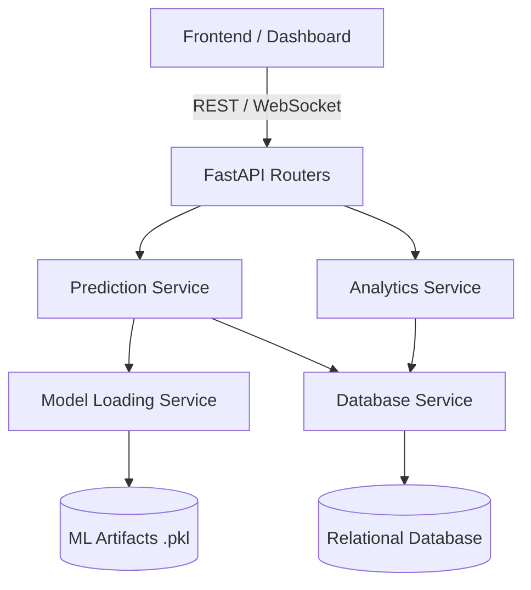

# Backend Architecture

This document describes the recommended backend architecture for the Groundwater Intelligence Platform. Note that no application logic is currently implemented in the repository.

## Recommended Backend Structure
The backend is planned to be built with **FastAPI**. It should follow a modular, service-oriented architecture:

```
backend/app/
├── api/             # API routing and endpoint definitions
├── core/            # Configuration and global constants
├── database/        # Database session and models
├── services/        # Business logic and ML interaction
└── utils/           # Shared utility functions
```

## Service Layers

### 1. Prediction Service
- **Responsibility**: Handle inference requests.
- **Workflow**: Receive data -> Call Preprocessing -> Call Model Loading Service -> Execute Inference -> Format Response.

### 2. Model Loading Service
- **Responsibility**: Efficiently load and cache ML artifacts (models and scalers) from the `ml/artifacts/` directory.
- **Workflow**: Prevent loading the same model repeatedly by implementing a caching mechanism (e.g., LRU Cache) for frequently accessed stations.

### 3. Analytics Service
- **Responsibility**: Provide historical data aggregations, trends, and summary statistics for the dashboard.
- **Workflow**: Query the database for past readings and anomalies, format them for frontend consumption.

### 4. Database Service
- **Responsibility**: Abstract all CRUD operations.
- **Workflow**: Interface with SQLAlchemy to write new readings, store predictions, and fetch station metadata.

## API Routing
- **Modular Routers**: API endpoints should be grouped logically (e.g., `/api/stations`, `/api/forecast`, `/api/analytics`).
- **Dependencies**: Use FastAPI's Dependency Injection for database sessions and authentication.

## Utilities
- **Data Validation**: Pydantic models for request and response validation.
- **Time/Date Parsers**: Consistent handling of timezones and timestamps.

## Error Handling
- **Global Exception Handler**: Catch unhandled exceptions and return consistent JSON error formats.
- **Custom Exceptions**: Defined for specific scenarios like `ModelNotFoundError`, `StationNotFoundError`, and `InvalidInputDataError`.

## Configuration Management
- Use `pydantic-settings` to manage environment variables (e.g., Database URL, API Keys).
- A `.env.example` file is provided to template configuration parameters.

## Architecture Diagram

