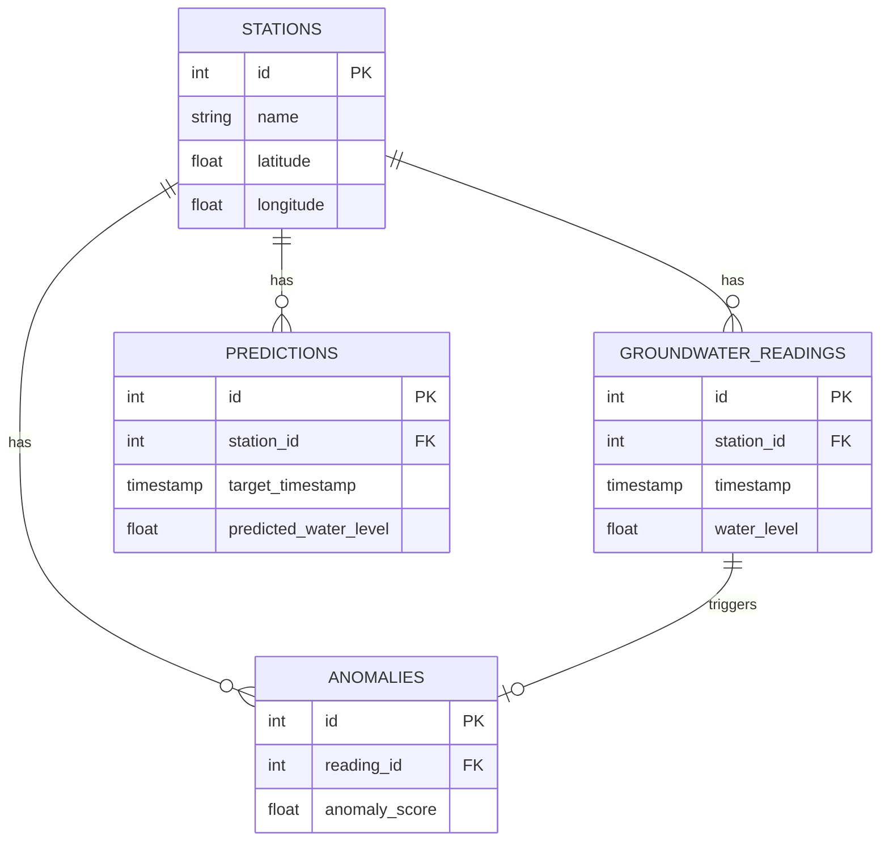

# Database Schema

This document outlines the planned relational database schema for the Groundwater Intelligence Platform.

## Tables

### 1. Stations
Stores metadata about each monitoring location.
- **id** (Primary Key, UUID/Integer)
- **name** (String, Unique) - e.g., "AMBERPET_1"
- **latitude** (Float)
- **longitude** (Float)
- **district** (String)
- **created_at** (Timestamp)

### 2. Groundwater Readings
Stores historical raw and cleaned readings.
- **id** (Primary Key, UUID/Integer)
- **station_id** (Foreign Key -> Stations.id)
- **timestamp** (Timestamp, Indexed)
- **water_level** (Float)
- **is_cleaned** (Boolean)
- **created_at** (Timestamp)

### 3. Predictions (Forecast History)
Stores the outputs generated by the ML models to track performance over time.
- **id** (Primary Key, UUID/Integer)
- **station_id** (Foreign Key -> Stations.id)
- **prediction_timestamp** (Timestamp, when the prediction was made)
- **target_timestamp** (Timestamp, the future date being predicted)
- **predicted_water_level** (Float)
- **actual_water_level** (Float, Nullable - updated later for evaluation)
- **model_version** (String)

### 4. Anomalies
Stores flagged anomalous readings for review.
- **id** (Primary Key, UUID/Integer)
- **reading_id** (Foreign Key -> Groundwater Readings.id)
- **station_id** (Foreign Key -> Stations.id)
- **anomaly_score** (Float)
- **is_verified** (Boolean, User verified)
- **detected_at** (Timestamp)

### 5. Users (Future)
For dashboard authentication and role-based access.
- **id** (Primary Key, UUID/Integer)
- **username** (String, Unique)
- **password_hash** (String)
- **role** (String)

### 6. Audit Logs
Tracks system events and user actions.
- **id** (Primary Key, UUID/Integer)
- **action** (String)
- **user_id** (Foreign Key -> Users.id, Nullable)
- **timestamp** (Timestamp)
- **details** (JSON)

---

## Relationships & Foreign Keys
- A **Station** has many **Groundwater Readings** (1:N)
- A **Station** has many **Predictions** (1:N)
- A **Station** has many **Anomalies** (1:N)
- An **Anomaly** maps to exactly one **Groundwater Reading** (1:1)

## Indexes
To ensure high performance on time-series queries, the following indexes are required:
- `idx_readings_station_time`: Composite index on `Groundwater Readings (station_id, timestamp)`
- `idx_predictions_station_target`: Composite index on `Predictions (station_id, target_timestamp)`

## Diagram

