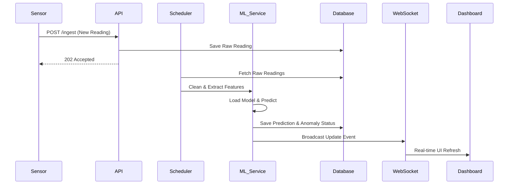

# Real-time Pipeline Architecture

This document describes the planned architecture for real-time (or near real-time) data ingestion, prediction, and dashboard updates.

## Architecture Flow

### 1. Data Ingestion
- **Source**: DWLR IoT sensors or periodic scheduled uploads (e.g., FTP drops or API pushes).
- **Ingestion Endpoint**: A dedicated FastAPI endpoint (`POST /ingest`) receives the incoming data payload.

### 2. Database Update
- The raw reading is immediately written to the `Groundwater Readings` database table.
- A flag `is_cleaned=False` is set until the background preprocessing runs.

### 3. Scheduler & Preprocessing
- A background task scheduler (e.g., Celery, APScheduler, or a simple FastAPI background task) picks up new raw readings.
- Missing values are imputed (if necessary), and features are engineered.
- The record is updated to `is_cleaned=True`.

### 4. Prediction Trigger
- Once data is cleaned, it triggers the Inference Pipeline.
- The Prediction Service loads the specific station's model and scalers from `ml/artifacts/`.
- A new forecast (and anomaly check) is generated.
- Results are saved to the `Predictions` and `Anomalies` tables.

### 5. WebSocket Flow
- The backend maintains active WebSocket connections with connected Dashboard clients.
- Upon successful prediction or anomaly detection, a JSON payload is broadcasted over the WebSocket channel.

### 6. Frontend Refresh
- The React frontend receives the WebSocket message.
- The state management store (e.g., Redux, Zustand) is updated.
- Relevant charts and notification icons re-render instantly without requiring a page refresh.

## Failure Handling
- **Dead Letter Queue (DLQ)**: If inference fails (e.g., corrupted data, missing model), the job is pushed to a DLQ for manual inspection.
- **Fallback**: If the real-time pipeline lags, the frontend can always fallback to standard REST API polling (`GET /stations/{id}/data`) to fetch the latest state.

## Diagram

